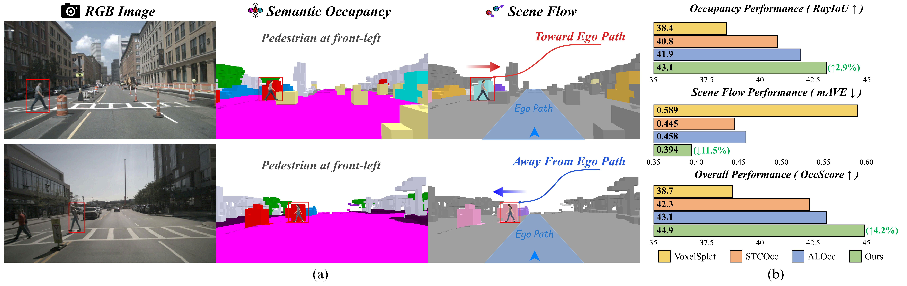
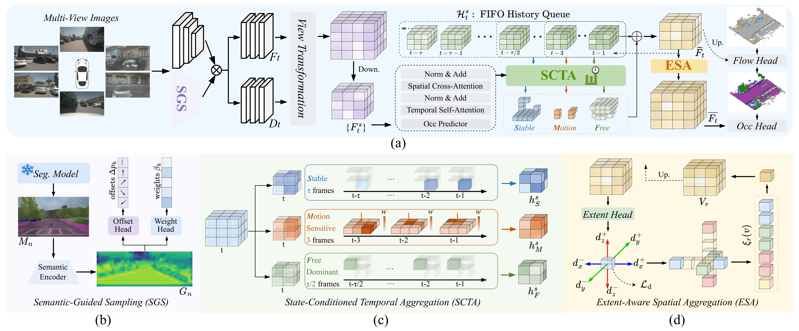
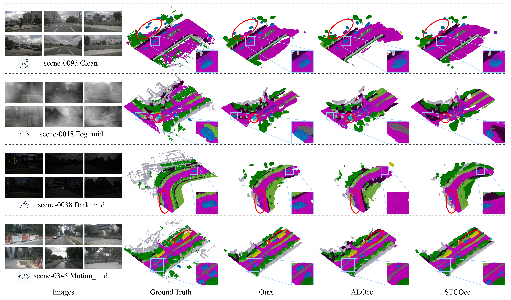
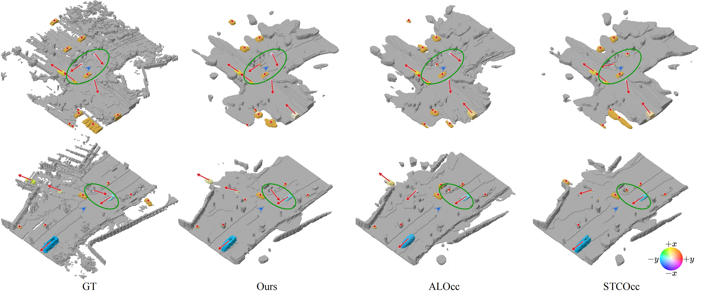

# 🚗 𝑺𝒆𝒍𝒆𝒄𝒕𝑶𝒄𝒄𝑭𝒍𝒐𝒘

### Selective Spatiotemporal Aggregation for 3D Occupancy and Scene Flow Prediction

**3D Occupancy · Scene Flow**

 

[🌟 Overview](#-overview) ·
[🎬 Demo](#-demo) ·
[🧩 Framework](#-framework) ·
[🎨 Visualization](#-visualization) ·
[🚀 Release](#-release-status)

 

🚧 **Code & checkpoints coming soon.**

## 🌟 Overview

  

## 🎬 Demo

  

  Qualitative visualization of 3D occupancy and scene flow predictions.

## 🧩 Framework

  

It progressively refines complementary evidence across image, temporal, and voxel spaces to improve dynamic 3D scene understanding.

  <b>🖼️ Image Space &nbsp;&nbsp; → &nbsp;&nbsp; ⏱️ Temporal Space &nbsp;&nbsp; → &nbsp;&nbsp; 🧊 Voxel Space</b>

## 🎨 Visualization

  <b>Semantic Occupancy</b>

  

 

  <b>Scene Flow</b>

  

## 🚀 Release Status

✅ 🎬 **SelectOccFlow demo video** released.

⏳ 💻 Source code coming soon.

⏳ 🧠 Pretrained models coming soon.

⏳ 📦 Evaluation scripts coming soon.

## 🙏 Acknowledgements

We thank the authors and contributors of the open-source projects and datasets that make this work possible.

### SelectOccFlow

**3D Occupancy · Scene Flow**

 

⬆️ [Back to Top](#-selectoccflow)

